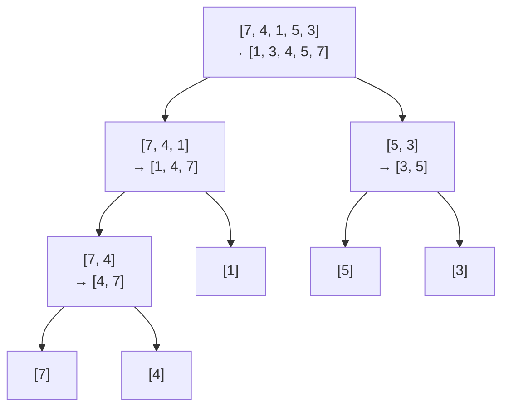

Sort an array of integers in non-decreasing order using merge sort.

## Examples

```
Input:  nums = [7, 4, 1, 5, 3]
Output: [1, 3, 4, 5, 7]
```

```
Input:  nums = [5, 4, 4, 1, 1]
Output: [1, 1, 4, 4, 5]
```

{: .intuition }
> **Divide in half, sort each half, merge two sorted halves.** Keep splitting until one element is left, because a single element is already sorted. Merging uses two pointers: always take the smaller front element into `temp`, then copy `temp` back into `nums[start..end]`.

## Dry run

Split down, merge up: each node shows its part `→` the merged result.



Array after each `merge` call:

<div class="viz">
<p class="viz-legend"><span class="hl">■ just merged</span> · <span class="done">■ final</span></p>





</div>

## Code

```cpp
class Solution {
public:
void merge(vector<int>& nums, int start, int mid,int end){
    vector<int> temp;
    int left = start;
    int right = mid +1 ;
     while (left <= mid && right <= end) {

            if (nums[left] <= nums[right]) {
                temp.push_back(nums[left]);
                left++;
            }
            else {
                temp.push_back(nums[right]);
                right++;
            }
        }
        while (left <= mid) {
            temp.push_back(nums[left]);
            left++;
        }
 
        while (right <= end) {
            temp.push_back(nums[right]);
            right++;
        }
 
        for (int i = start; i <= end; i++) {
            nums[i] = temp[i - start];
        }
 

}
void mergeSortHelper(vector<int>&nums,int start , int end){
    if(start>=end)
    return;
    int mid = (start+end)/2;
    mergeSortHelper(nums,start,mid);
    mergeSortHelper(nums, mid+1,end);
    merge(nums,start,mid,end);
}
    vector<int> mergeSort(vector<int>& nums) {
        int start = 0;
         int end = nums.size()-1;
        mergeSortHelper(nums,start,end);
        return nums;


    }
};
```

{: .pitfall }
> Copy back with `temp[i - start]`, not `temp[i]`, because `temp` starts at 0 but the range starts at `start`. Don't forget the two leftover loops: one half usually runs out first.

{: .revisit }
> Always O(n log n), even in the worst case, unlike quick sort. It needs O(n) extra space, though. `<=` (not `<`) takes from the left half on ties, which keeps it **stable**. This merge step is reused in "count inversions" and "reverse pairs".
